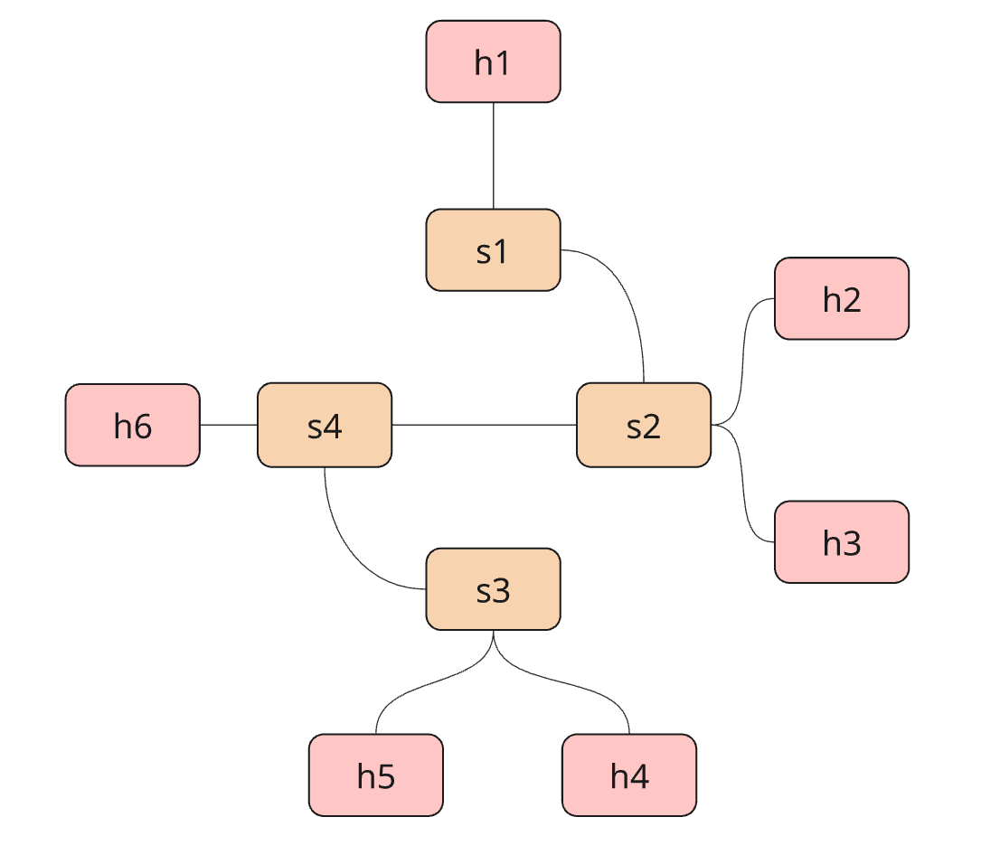
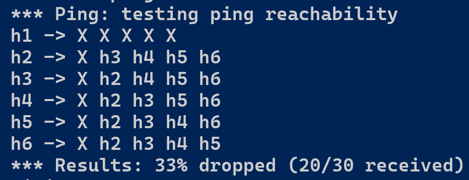

# PatchHunter

## Description

PatchHunter is a Python application which implements intent-based networking using a large language model (LLM). It integrates Claude Sonnet 4 within the decision-making process of an SDN network by receiving user input and a snapshot of the current state of the network in order to diagnose relevant network problems as well as propose and implement changes in the SDN controller. The objective is to simplify and automate network management by allowing human operators to interact with the network using natural language, enabling faster troubleshooting and action implementation, intelligent decision-making, and improved discovery and control in dynamic SDN environments. 

## Main Features

#### **Dynamic Network State Retrieval**
Gathers real-time data about the network from the SDN controller, including MAC tables, port statistics, stop port states, flow tables, and host-to-switch mappings. This allows the system to maintain an up-to-date snapshot view of the network state for monitoring and decision-making. 

#### **LLM-Powered Network Diagnostics**
Anomaly detection and response. Uses Claude Sonnet 4 (20250514) to detect signs of congestion, port failures, and unreachable hosts in the network and helps to suggest steps to take to verify the issue. 

#### **Intent-Based Inference**
Translates natural language intents from the network engineer into SDN controller -compatible actions and implements them in the network. The system can interpret the network engineer’s high-level goal, e.g. “Reconfigure flows to block all communication between hosts h3 and h4” and translate it into concrete network objectives. The system interprets the goal and aligns it with the network’s current state.

#### **Controller-Side Action Implementation**
Executes LLM-generated actions directly within the SDN controller using OpenFlow commands. This includes installing and removing flows, modifying and monitoring port states, checking host locations, and tracing the route that data packets take to arrive at their destinations.

## How Does It Work?
- **Network state retrieval:** When the user has requested action, the current state of the network is retrieved for analysis. A JSON object containing the switches, MAC tables, port statistics, port descriptions, stp port states, flow tables, and host-to-switch mappings is retrieved and sent to the LLM for analysis in the first query.
- **Network topology retrieval:** Similarly to the network state data, the network topology, consisting of a static JSON file, is retreived, parsed, and also sent to the LLM along with the first query as contextual information.
- **Recommendation and decision-making:** The user intent, network state and topology data, and the general rules of SDN controller operations are combined to query for a formal diagnosis and recommendation for actionable steps to take to confirm or solve the problem.
- **Format validation:** A second query to the LLM is performed in order to ensure that the actionable output (a list of JSON objects) provided by the first query is precise and in the correct format. This is done to increase the consistency of the final LLM output and make sure that it can be understood and implemented by the SDN controller. It is an important step of the process as general-purpose LLMs, such as ChatGPT and Claude Sonnet, lack the specific fine-tuning for network management and may thus produce varying output, particularly when query prompts are large and contain larger quantities of necessary contextual data.
- **Action implementation:**  If actionable steps are suggested, the network engineer can review the recommendation and allow or deny the actions. If the actions are denied, the agent will return to wait for a new user input. If the user accepts the actions, they will be implemented in the SDN controller directly. 
- **Logging:** The network state snapshots are stored in the logs/ folder by timestamp.json for future monitoring and improvement. 

## Requirements, Installation & Running the App

### Requirements
The application requires **Mininet** and runs on **Python3** (Python 3.8.0 was used in development) 
Required libraries include: 
- anthropic v.0.60.0
- python-dotenv v.1.0.1
- requests v.2.32.4
- ryu v.4.34
- mininet v.2.3.0.dev6

The Python library requirements are also available in the `requirements.txt` file in the repository root folder. 

### Installation
1. Clone the repository in your local machine as follows: 
`git clone https://github.com/wannalina/networking-project.git`
2. Install the dependencies: 
`pip install -r requirements.txt`
3. Ensure that Mininet is up and running

### Running the App

1. **Start**
Move yourself to a separated environment, like comnetsemu.

2. **Mininet and topology initialization:** 
Use the following command: 
`sudo python3 mininet/topology.py`
This will initialize the Mininet network simulation, start the RYU controller, and build the static topology consisting of four switches and six hosts, with the links formed as follows: 

Once the controller has finished initializing, test it using the `pingall` command to verify that all hosts can reach each other.

3. **Initialize the main application**
Use the following command to initialize PatchHunter: 
`sudo python3 northbound_agent.py`

4. **Ask questions and perform actions**
Observe that the command line interface of `northbound_agent.py`, the program asks for user input (intent). 
On this command line, enter a question or a command, for example, "Please disable all ports on switch 1". 
Then, review the agent's repsonse. If the proposed action corresponds to what you want to achieve, reply "yes" to the agent to confirm and execute the action.

5. **Test the action**
If you used the above example, you can test the change using one of the following two methods: 
- **Use the `pingall` function in the Mininet terminal.** Because the topology links are configured such that host 1 only connects to switch 1 (and no other hosts connect directly to this switch), disabling the ports of switch 1 should effectively cut off host 1 from the rest of the network. This means that host 1 should not be able to communicate with any other host and the `pingall` table should look like this:

- **Ask PatchHunter to check the status of all ports on switch 1.** In this case, the LLM response should suggest a `check_port_status` action, to which you must reply "yes" to execute. The final response should return `state: 1` for allports on the switch or otherwise indicate in natural language that the port is in state `down`.

6. **To exit the program**, stop the PatchHunter application by typing "exit" on the `northbound_agent.py` command line interface. Then stop the Mininet instance using the following command: 
`exit`
Finally, clear and clean up any leftover Mininet network states and processes using the command: 
`sudo mn -c`

## LLM Integration Specifics

### Choosing the model
Claude Sonnet was primarily chosen for this project after experimentation with different common general-purpose LLM models available on the market, mainly ChatGPT.
During development, I tested several GPT models (3.5, 4o, 4 Turbo, etc.) and a couple of Claude Sonnet models (Sonnet 4, Sonnet 3.7, Haiku 3.5, etc.) to evaluate trade-offs in performance, required prompt complexity, response accuracy, allowed tokens, latency, and cost. Finally, I decided to use Claude Sonnet 4 as it offers the best balance between inference quality, reliability of structured output (necessary for SDN controller -compatibility), speed, and support for precise, intent-driven diagnostics that this project requires.

### Building the prompt
Designing prompts for interacting with the LLM was a key concept (and one of the biggest challenges) of this project, particularly because the model's output directly affects network behavior via the SDN controller. The development efforts included experimenting with the prompt content, ordering, and length. 
The construction of the decision prompt involved defining the following components: 
1. **Defining a role:** The LLM is instructed to behave as an SDN expert or an assistant to the network engineer (user).
2. **Clear task instructions:** A natural language description of what should be done (user intent).
3. **Context:** The network topology, current network state, and the user intent.
4. **Reasoning guidelines** Guidelines for how the LLM should proceed with the task to reach the desired output. 
5. **Output formatting:** All responses must follow a specific JSON schema in order to be interpreted correctly by the SDN controller.
6. **Stop condition:** A stop condition is included to inform the LLM of when the task can be considered complete.

### Prompt engineering process
In finding the best balance between performance, output quality, and cost, several iterations were performed: 

1. **A single, unified prompt**
The first approach to LLM interaction used a single, unified prompt that combined the user's intent, the unrefined network state snapshot, and the rest of the instruction points described above combined into one large query. While this method was functional and avoided the need for multiple queries, it had several limitations. Responses were slow due to the input size and complexity, responses were often unstable or inaccurate, and allowed token limits were occasionally exceeded resulting in a discarding of the query.

2. **Three separate prompts**
In the second iteration, the process was divided into three separate prompts to analyze the user intent, the network state, and to form a final recommendation/decision. This resulted in clearer and more accurate responses in terms of diagnostics and decision-making. Errors in JSON formatting were also reduced significantly. However, after testing this for a while, it seemed that separately analysing user intent increased costs and compute time, but did not provide noticeable added value to the responses. Some responses remained inaccurate and did not give a complete solution to the user's intent.

3. **Two-step prompt strategy**
The two-step prompting strategy went through several iterations in finding the most useful way to spli tthe tasks in each query to guarantee a precise and complete solution to the network engineer's problem (still taking into account the limitations of a general-purpose LLM). The first iteration consisted of having one query to analyze the current network state and the second one to convert the most relevant network findings to an instruction JSON object list for the SDN controller. This reduced the size of the query which helped to make the outputs of the second query more focused to answer the user intent. However, the unreliability of output formatting remained a significant problem in this implementation.

The **final implementation** consists of two LLM queries. The first query is designed to process the task instructions, context (user intent, network topology, and current network state), and all the general decision-making of the PatchHunter application. The second query then takes the instruction object list generated by the first query and inspects it to make sure that it is a valid JSONobject list, it contains all required fields for the specific action, it does not contain any extra fields, and each field is in the correct data structure. This strategy proved the most successful in terms of both gaining a useful and complete output from the LLM as well as formatting the object list correctly and ina  consistent way.

Although some limitations still exist when asking the model very general questions about the network or potential anomalies (as is expected when using vague or open-ended language), this strategy proved the most efficient in practice as it reduces token usage, minimizes latency, and improves overall reliability without sacrificing interpretability or network security.

## FAQ

#### What kinds of questions can I ask PatchHunter?
PatchHunter takes the user's queries as natural language questions or commands. These questions/commands may relate to diagnosing problems in the network, such as congestion or misconfigurations, locating specific hosts, checking port statuses or changing their states, and routing -related requests. You may ask questions like: 
- "Reconfigure flows such that h3 and h4 cannot communicate."
- "Reconfigure flows such that h3 and h4 can communicate again."
- "Where is host h5 in the network?" 
- "Which hosts are connected to switch 3?"
- "Disable all ports on switch 1."
- "Restore forwarding state on switch 2 port 8."
- "Which route do packets take from h1 to h6?"

Questions, such as, "Can you detect any anomalies in the network?" or "What actions would you recommend for improving the current state of the network?" are not advised as Claude Sonnet 4 is a general-purpose LLM, which is not trained for network management. This means that it may encounter difficulties in interpreting questions or commands that lack clear intent, forcing the model to infer a lot on its own, which can lead to misdiagnosis as well as unnecessary or even incorrect actions. Although PatchHunter has been tested extensively and generally performs well, it may still occasionally make erroneous assumptions. Therefore, it is strongly recommended to keep questions and commands specific and actionable as shown in the examples above.

#### What is included in the network snapshot and why?
Each network snapshot includes the following, aggregated from all active switches: a list of switch IDs, the MAC table (mac_to_port), the host table (per-MAC location), port statistics, port description stats, STP port states, and flow stats. Although more network components can be additionally measured, these components are specifically chosen as they provide a sufficient picture of the network while still considering the cost and accuracy trade-offs of passing large network state objects to an LLM model **(It is more useful to ask an LLM to interpret a short network snapshot even if it contains less data as it can easily get confused when overwhelmed with large data volumes)**. 
The currently provided data allows the LLM to determine the following: 
- **Switches:** Which datapaths are currently registered and available for actions.
- **MAC table:** Location of components in the network (hosts, switches, etc.) & detection of duplicate or flapping MAC addresses
- **Port stats:** Assists in congestion detection and packet loss discovery through per-port counters
- **Port description stats:** Administrative / operational state and attributes to spot down / misconfigured links
- **STP port states:** Whether a port is FORWARD / BLOCK / etc., to avoid suggesting flows on blocked paths.
- **Flow stats:** Installed matches / actions with packet / byte counts to find missing / incorrect rules.
- **Host table:** Direct host to switch / port mapping to trace paths and verify reachability.

The data is kept up to date in the SDN controller by issuing Ryu OpenFlow `requests—parser.OFPPortStatsRequest()` for per-port counters, `parser.OFPPortDescStatsRequest()` for port attributes / state, and `parser.OFPFlowStatsRequest()` for installed flow entries.

#### Can PatchHunter modify the network automatically? 
Only with user confirmation. It is improtant that the network engineer first carefully reviews the agent's recommendations and proposed actions before permitting them. While Claude Sonnet 4 is powerful, it may misinterpret ambigious input or edge-case data, which is why all actions require careful review by the user and explicit confrimation before modifying the network state.

#### How are the actions applied to the SDN controller?
After receiving a response from the LLM, the list of JSON objects with the proposed actions is extracted and sent directly to the SDN controller using a REST API post request. The controller then interprets the actions and executes them using custom functions like `set_port_state()` for setting a new port state or `get_host_location()` for retrieving the location of a host in the network as well as RYU's built-in functions like `add_flow()` for installing new flows or `remove_flow()` for removing them.